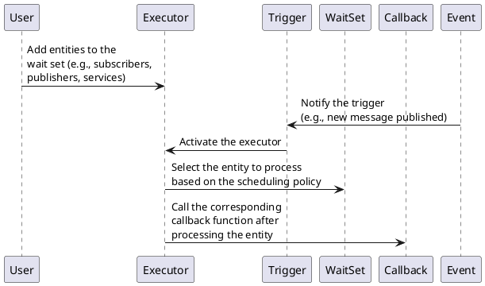
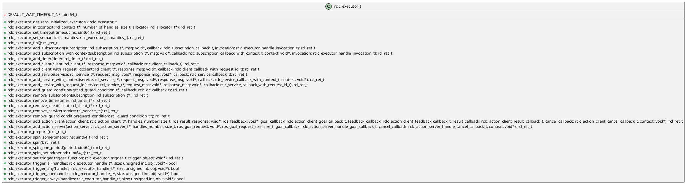
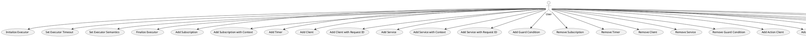
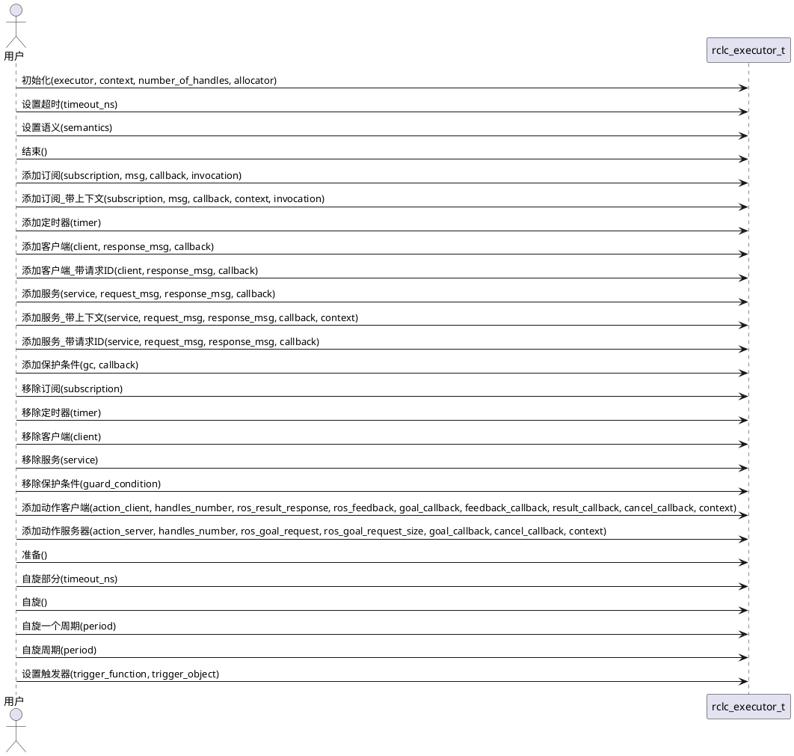

#

##

```c
#define DEFAULT_WAIT_TIMEOUT_NS 1000000000
static bool _rclc_executor_is_valid(rclc_executor_t *executor);
rclc_executor_t rclc_executor_get_zero_initialized_executor();
rcl_ret_t rclc_executor_init(rclc_executor_t *executor,
                             rcl_context_t *context,
                             const size_t number_of_handles,
                             const rcl_allocator_t *allocator);
rcl_ret_t rclc_executor_set_timeout(rclc_executor_t *executor, const uint64_t timeout_ns);
rcl_ret_t rclc_executor_set_semantics(rclc_executor_t *executor,
                                      rclc_executor_semantics_t semantics);
rcl_ret_t rclc_executor_fini(rclc_executor_t *executor);
```

```c
rcl_ret_t rclc_executor_add_subscription(rclc_executor_t *executor,
                                         rcl_subscription_t *subscription,
                                         void *msg,
                                         rclc_subscription_callback_t callback,
                                         rclc_executor_handle_invocation_t invocation);
rcl_ret_t rclc_executor_add_subscription_with_context(
    rclc_executor_t *executor,
    rcl_subscription_t *subscription,
    void *msg,
    rclc_subscription_callback_with_context_t callback,
    void *context,
    rclc_executor_handle_invocation_t invocation);
rcl_ret_t rclc_executor_add_timer(rclc_executor_t *executor, rcl_timer_t *timer);
rcl_ret_t rclc_executor_add_client(rclc_executor_t *executor,
                                   rcl_client_t *client,
                                   void *response_msg,
                                   rclc_client_callback_t callback);
rcl_ret_t rclc_executor_add_client_with_request_id(rclc_executor_t *executor,
                                                   rcl_client_t *client,
                                                   void *response_msg,
                                                   rclc_client_callback_with_request_id_t callback);
rcl_ret_t rclc_executor_add_service(rclc_executor_t *executor,
                                    rcl_service_t *service,
                                    void *request_msg,
                                    void *response_msg,
                                    rclc_service_callback_t callback);
rcl_ret_t rclc_executor_add_service_with_context(rclc_executor_t *executor,
                                                 rcl_service_t *service,
                                                 void *request_msg,
                                                 void *response_msg,
                                                 rclc_service_callback_with_context_t callback,
                                                 void *context);
rcl_ret_t rclc_executor_add_service_with_request_id(
    rclc_executor_t *executor,
    rcl_service_t *service,
    void *request_msg,
    void *response_msg,
    rclc_service_callback_with_request_id_t callback);
rcl_ret_t rclc_executor_add_guard_condition(rclc_executor_t *executor,
                                            rcl_guard_condition_t *gc,
                                            rclc_gc_callback_t callback);
```

很抱歉，我会更详细地解释这些函数的功能和含义。

`rclc` 库是 ROS2 项目中的一个轻量级 C 语言客户端库，它提供了一种简化的 API 来管理和调度订阅、服务、客户端和定时器等不同类型的处理程序。执行器（executor）是 rclc 中的核心组件之一，负责协调和调度这些处理程序。

以下是这些函数的功能和含义：

### 执行器初始化和设置

1. **rclc_executor_get_zero_initialized_executor()**：返回一个零初始化的执行器实例。在使用执行器之前，需要对其进行初始化。
2. **rclc_executor_init()**：初始化执行器，设置上下文、句柄数量和内存分配器。上下文用于与 ROS2 系统通信，句柄数量表示执行器可以管理的最大处理程序数量，内存分配器用于动态分配内存。
3. **rclc_executor_set_timeout()**：设置执行器的超时时间（纳秒）。当执行器在此时间内没有收到任何新事件时，它将返回超时错误。
4. **rclc_executor_set_semantics()**：设置执行器的调度语义。调度语义决定了执行器如何选择要执行的处理程序。例如，可以选择按照添加顺序执行处理程序，或者根据优先级执行处理程序。
5. **rclc_executor_fini()**：清理执行器，释放资源。在不再需要执行器时，应调用此函数以避免内存泄漏。

### 向执行器添加处理程序

6. **rclc_executor_add_subscription()**：向执行器添加订阅，包括订阅回调和调用方式。订阅回调是当收到新消息时要执行的函数，调用方式决定了回调函数何时被执行（例如，在新线程中或在当前线程中）。
7. **rclc_executor_add_subscription_with_context()**：与上述函数类似，但允许传递上下文参数。上下文参数可以在回调函数中使用，以便在多个订阅之间共享数据。
8. **rclc_executor_add_timer()**：向执行器添加定时器。定时器会在指定的时间间隔内触发回调函数。
9. **rclc_executor_add_client()**：向执行器添加客户端，包括客户端回调。客户端回调是当收到服务响应时要执行的函数。
10. **rclc_executor_add_client_with_request_id()**：与上述函数类似，但允许传递请求 ID。请求 ID 可以用于跟踪多个并发请求。
11. **rclc_executor_add_service()**：向执行器添加服务，包括服务回调。服务回调是当收到服务请求时要执行的函数。
12. **rclc_executor_add_service_with_context()**：与上述函数类似，但允许传递上下文参数。上下文参数可以在回调函数中使用，以便在多个服务之间共享数据。
13. **rclc_executor_add_service_with_request_id()**：与上述函数类似，但允许传递请求 ID。请求 ID 可以用于跟踪多个并发请求。
14. **rclc_executor_add_guard_condition()**：向执行器添加保护条件，包括保护条件回调。保护条件是一种特殊的事件，当满足某些条件时会触发回调函数。

这些函数之间的关系是：首先使用 `rclc_executor_init()` 初始化执行器，然后根据需要向执行器添加订阅、服务、客户端和定时器等处理程序。在添加了所有处理程序后，执行器将根据设置的超时时间和调度语义来调度这些处理程序。最后，使用 `rclc_executor_fini()` 清理执行器并释放资源。

##

```c
static rcl_ret_t _rclc_executor_remove_handle(rclc_executor_t *executor,
                                              rclc_executor_handle_t *handle);
static rclc_executor_handle_t *_rclc_executor_find_handle(rclc_executor_t *executor,
                                                          const void *rcl_handle);
rcl_ret_t rclc_executor_remove_subscription(rclc_executor_t *executor,
                                            const rcl_subscription_t *subscription);
rcl_ret_t rclc_executor_remove_timer(rclc_executor_t *executor, const rcl_timer_t *timer);
rcl_ret_t rclc_executor_remove_client(rclc_executor_t *executor, const rcl_client_t *client);
rcl_ret_t rclc_executor_remove_service(rclc_executor_t *executor, const rcl_service_t *service);
rcl_ret_t rclc_executor_remove_guard_condition(rclc_executor_t *executor,
                                               const rcl_guard_condition_t *guard_condition);
```

这段代码主要包含了一些用于操作执行器中实体的函数。

1. `_rclc_executor_remove_handle`：这是一个静态函数，用于从执行器中移除指定的句柄。它会遍历执行器中的句柄数组，找到与给定句柄匹配的项，并将其从数组中删除。
2. `_rclc_executor_find_handle`：这也是一个静态函数，根据给定的 rcl_handle 在执行器中查找对应的句柄。它会遍历执行器中的句柄数组，找到与给定 rcl_handle 匹配的项，并返回该句柄。
3. `rclc_executor_remove_subscription`：此函数用于从执行器中移除指定的订阅。它首先调用 `_rclc_executor_find_handle` 函数，在执行器中查找与给定订阅相关的句柄。然后，它调用 `_rclc_executor_remove_handle` 函数将找到的句柄从执行器中移除。
4. `rclc_executor_remove_timer`：此函数用于从执行器中移除指定的定时器。它的工作原理与 `rclc_executor_remove_subscription` 类似，只是针对定时器实体。
5. `rclc_executor_remove_client`：此函数用于从执行器中移除指定的客户端。它的工作原理与 `rclc_executor_remove_subscription` 类似，只是针对客户端实体。
6. `rclc_executor_remove_service`：此函数用于从执行器中移除指定的服务。它的工作原理与 `rclc_executor_remove_subscription` 类似，只是针对服务实体。
7. `rclc_executor_remove_guard_condition`：此函数用于从执行器中移除指定的保护条件。它的工作原理与 `rclc_executor_remove_subscription` 类似，只是针对保护条件实体。

这些函数之间的关系主要通过执行器（`rclc_executor_t`）实现。执行器包含了所有实体的句柄（`rclc_executor_handle_t`），并负责管理和调度它们。这段代码的主要目的是提供一组 API，以便在运行过程中可以动态地添加或删除节点中的实体。这有助于实现更灵活、可扩展的 ROS2 节点。

##

```c
rcl_ret_t rclc_executor_add_action_client(
    rclc_executor_t *executor,
    rclc_action_client_t *action_client,
    size_t handles_number,
    void *ros_result_response,
    void *ros_feedback,
    rclc_action_client_goal_callback_t goal_callback,
    rclc_action_client_feedback_callback_t feedback_callback,
    rclc_action_client_result_callback_t result_callback,
    rclc_action_client_cancel_callback_t cancel_callback,
    void *context);
rcl_ret_t rclc_executor_add_action_server(
    rclc_executor_t *executor,
    rclc_action_server_t *action_server,
    size_t handles_number,
    void *ros_goal_request,
    size_t ros_goal_request_size,
    rclc_action_server_handle_goal_callback_t goal_callback,
    rclc_action_server_handle_cancel_callback_t cancel_callback,
    void *context);
```

这段代码是 ROS2 项目中的 RCLC（ROS Client Library for C）执行器部分，主要用于处理动作客户端和动作服务器。以下是这两个函数的功能和含义：

1. `rclc_executor_add_action_client` 函数：

   这个函数用于将一个动作客户端添加到执行器中。它需要以下参数：
   
   - `executor`: 执行器实例的指针。
   - `action_client`: 要添加的动作客户端实例的指针。
   - `handles_number`: 动作客户端所需的句柄数量。
   - `ros_result_response`: 结果响应的指针。
   - `ros_feedback`: 反馈信息的指针。
   - `goal_callback`: 当收到目标请求时调用的回调函数。
   - `feedback_callback`: 当收到反馈时调用的回调函数。
   - `result_callback`: 当收到结果响应时调用的回调函数。
   - `cancel_callback`: 当收到取消请求时调用的回调函数。
   - `context`: 用户定义的上下文数据。

2. `rclc_executor_add_action_server` 函数：

   这个函数用于将一个动作服务器添加到执行器中。它需要以下参数：
   
   - `executor`: 执行器实例的指针。
   - `action_server`: 要添加的动作服务器实例的指针。
   - `handles_number`: 动作服务器所需的句柄数量。
   - `ros_goal_request`: 目标请求的指针。
   - `ros_goal_request_size`: 目标请求的大小。
   - `goal_callback`: 当收到目标请求时调用的回调函数。
   - `cancel_callback`: 当收到取消请求时调用的回调函数。
   - `context`: 用户定义的上下文数据。

这两个函数的主要作用是将动作客户端和动作服务器添加到执行器中，以便在运行时处理它们的事件。通过使用回调函数，用户可以自定义如何处理不同类型的事件，例如目标请求、反馈、结果响应和取消请求。

##

```c
static rcl_ret_t _rclc_check_for_new_data(rclc_executor_handle_t *handle, rcl_wait_set_t *wait_set);
static rcl_ret_t _rclc_take_new_data(rclc_executor_handle_t *handle, rcl_wait_set_t *wait_set);
bool _rclc_check_handle_data_available(rclc_executor_handle_t *handle);
static rcl_ret_t _rclc_execute(rclc_executor_handle_t *handle);
static rcl_ret_t _rclc_default_scheduling(rclc_executor_t *executor);
static rcl_ret_t _rclc_let_scheduling(rclc_executor_t *executor);
```

在这段代码中，我们关注的是 RCLC 执行器部分，它负责管理和调度节点中的回调函数。

以下是这些函数的详细解释：

1. `_rclc_check_for_new_data` 函数：

   这个函数用于检查给定的执行器句柄是否有新数据。如果有新数据，它会返回 `RCL_RET_OK`，否则返回其他错误代码。它需要以下参数：
   
   - `handle`: 执行器句柄的指针。
   - `wait_set`: 等待集合的指针，包含了所有需要处理的实体（订阅器、服务等）。

2. `_rclc_take_new_data` 函数：

   这个函数用于从给定的执行器句柄获取新数据，并将其传递给相应的回调函数。它需要以下参数：
   
   - `handle`: 执行器句柄的指针。
   - `wait_set`: 等待集合的指针，包含了所有需要处理的实体（订阅器、服务等）。

3. `_rclc_check_handle_data_available` 函数：

   这个函数用于检查给定的执行器句柄是否有可用的数据。如果有可用数据，它会返回 `true`，否则返回 `false`。它需要以下参数：
   
   - `handle`: 执行器句柄的指针。

4. `_rclc_execute` 函数：

   这个函数用于执行给定的执行器句柄的回调函数。如果成功执行，它会返回 `RCL_RET_OK`，否则返回其他错误代码。它需要以下参数：
   
   - `handle`: 执行器句柄的指针。

5. `_rclc_default_scheduling` 函数：

   这个函数用于执行默认的调度策略（例如：轮询）。它会遍历所有的执行器句柄，检查是否有新数据，并执行相应的回调函数。它需要以下参数：
   
   - `executor`: 执行器实例的指针。

6. `_rclc_let_scheduling` 函数：

   这个函数用于执行 LET（Logical Execution Time）调度策略。这种策略允许在一个逻辑时间段内执行多个回调函数，以提高系统的实时性能。它需要以下参数：
   
   - `executor`: 执行器实例的指针。

总之，这些函数共同实现了 RCLC 执行器的核心功能，包括检查和获取新数据、执行回调函数以及实现不同的调度策略。通过使用这些功能，开发人员可以更方便地管理和调度 ROS2 节点中的各种实体。

##

```c
rcl_ret_t rclc_executor_prepare(rclc_executor_t *executor);
rcl_ret_t rclc_executor_spin_some(rclc_executor_t *executor, const uint64_t timeout_ns);
rcl_ret_t rclc_executor_spin(rclc_executor_t *executor);
rcl_ret_t rclc_executor_spin_one_period(rclc_executor_t *executor, const uint64_t period);
rcl_ret_t rclc_executor_spin_period(rclc_executor_t *executor, const uint64_t period);
rcl_ret_t rclc_executor_set_trigger(rclc_executor_t *executor,
                                    rclc_executor_trigger_t trigger_function,
                                    void *trigger_object);
bool rclc_executor_trigger_all(rclc_executor_handle_t *handles, unsigned int size, void *obj);
bool rclc_executor_trigger_any(rclc_executor_handle_t *handles, unsigned int size, void *obj);
bool rclc_executor_trigger_one(rclc_executor_handle_t *handles, unsigned int size, void *obj);
bool rclc_executor_trigger_always(rclc_executor_handle_t *handles, unsigned int size, void *obj);
```

这段代码主要实现了 rclc 库中的执行器（executor）功能，用于管理和调度 ROS2 中的回调函数。

以下是这些函数的详细功能和含义：

1. `rclc_executor_prepare`：准备执行器，初始化执行器的内部状态，包括分配内存、设置初始值等。
2. `rclc_executor_spin_some`：执行器运行一定时间（由参数 timeout_ns 指定），处理一部分可用的回调函数。此函数会根据触发条件选择要执行的回调函数，并在超时前尽可能多地执行回调函数。
3. `rclc_executor_spin`：执行器持续运行，处理所有可用的回调函数。此函数会不断检查触发条件，并执行满足条件的回调函数，直到程序结束或手动停止执行器。
4. `rclc_executor_spin_one_period`：执行器运行一个周期（由参数 period 指定），处理一个周期内可用的回调函数。此函数会在一个周期内执行满足触发条件的回调函数，然后等待下一个周期。
5. `rclc_executor_spin_period`：执行器按照指定周期（由参数 period 指定）运行，处理每个周期内可用的回调函数。此函数会在每个周期内执行满足触发条件的回调函数，直到程序结束或手动停止执行器。

6. `rclc_executor_set_trigger`：设置执行器的触发函数（由参数 trigger_function 指定），用于自定义执行器的触发条件。触发函数决定了哪些回调函数应该被执行，可以根据需要自定义。
7. `rclc_executor_trigger_all`：触发函数，当所有句柄都满足条件时返回 true。此函数可作为执行器的触发条件，表示只有当所有句柄都准备好时，才执行回调函数。
8. `rclc_executor_trigger_any`：触发函数，当任意一个句柄满足条件时返回 true。此函数可作为执行器的触发条件，表示只要有一个句柄准备好，就执行相应的回调函数。
9. `rclc_executor_trigger_one`：触发函数，当且仅当一个句柄满足条件时返回 true。此函数可作为执行器的触发条件，表示只有当恰好有一个句柄准备好时，才执行相应的回调函数。
10. `rclc_executor_trigger_always`：触发函数，始终返回 true。此函数可作为执行器的触发条件，表示无论何时都执行回调函数。

这些函数之间的关系主要体现在它们共同组成了执行器的功能。执行器负责管理和调度回调函数，根据不同的触发条件来决定何时运行哪些回调函数。通过设置不同的触发函数，可以实现不同的调度策略，以满足不同场景下的需求。

总的来说，这份文件的功能是实现 rclc 库中的执行器部分，用于管理和调度 ROS2 中的回调函数。执行器在 ROS2 系统中起到了关键作用，它能够确保系统中的各个组件按照预期顺序和时间进行通信和协作。

# uml

## 我在了解 rclc 中 exe@09:19:37

@Q: 
我在了解 rclc 中 executor 的源码时候，注意到有 executor、trigger、sheduling、wait_set、callback的概念，可以详细解释这几者之间的关系吗，可以通过 plantuml 的形式绘制相关的时序图、用例图等多个角度进行描述

@A: 
当然可以，让我为您解释这些概念以及它们之间的关系。请注意，由于 Markdown 限制，我无法直接在此处绘制 UML 图，但我会尽力通过文本描述帮助您理解。首先，我们了解一下这几个概念：

- **Executor**：执行器负责处理 ROS 2 节点中的事件（如订阅、发布、服务等）。在 rclc 中，执行器控制不同任务的调度和执行时间。
- **Trigger**：触发器是一种特殊类型的事件，当满足某些条件时，它会触发执行器开始执行事件处理。例如，当有新消息发布到主题时，触发器会激活执行器来处理这些消息。
- **Scheduling**：调度是执行器决定按照何种顺序处理事件的过程。在 rclc 中，执行器可以支持多种调度策略，如循环调度、优先级调度等。
- **Wait set**：等待集是一组已注册到执行器的事件实体（如订阅、发布、服务等）。执行器会根据调度策略处理等待集中的实体。
- **Callback**：回调函数是事件处理完毕后执行的特定函数，它为用户提供了事件处理结果的反馈。

接下来，让我们探讨一下它们之间的关系：

1. 用户通过向执行器添加实体（如订阅、发布、服务等）来设置应用程序。这些实体被添加到等待集中。
2. 当有事件发生（如新消息发布），触发器会激活执行器。
3. 执行器根据调度策略从等待集中选择要处理的实体。
4. 执行器处理所选实体，并在完成后调用相应的回调函数。

现在我们通过一个简单的时序图表示这个过程（以文本形式表示）：



这个时序图表达了前面解释过的 rclc 中 executor、trigger、scheduling、wait_set 以及 callback 的概念及它们之间的关系。希望这能帮助您更好地理解这几个概念。如有其他问题，请随时联系。

## 类图



## 用例图



## 时序图

